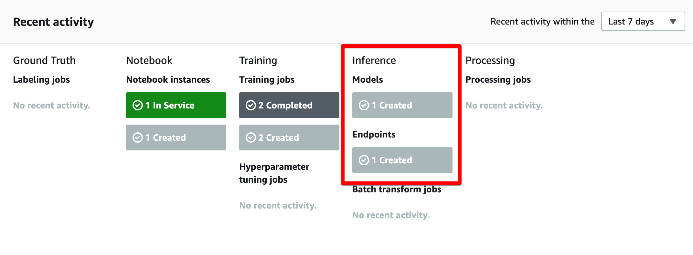
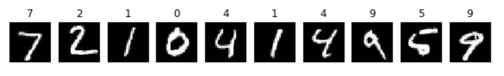
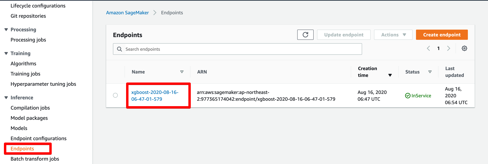

<p align="center">
  <a href="" rel="noopener">
 </a>
 <br>

</p>

<h3 align="center">SageMaker Tutorial</h3>

<div align="center">

[]()
[](https://github.com/da-huin/sage_maker_tutorial/issues)
[](https://github.com/da-huin/sage_maker_tutorial/pulls)
[](/LICENSE)


</div>

---

<p align="center"> 
    <br> This page is summary of [AWS SageMaker Get Started].
</p>

## 📝 Table of Contents

- [Getting Started](#getting_started)
- [Acknowledgments](#acknowledgement)

## 🏁 Getting Started <a name = "getting_started"></a>

We will use items to create a model.
* Data: MNIST Data (handwritten single digit numbers)
* Algorithm: XGBoost algorithm provided by Amazon SageMaker.

Full Code is in `src/tutorial.ipynb`

#### **1. Create an Amazon S3 Bucket**

* SageMaker save [The model training data] and [Model Artifacts]
* Include sagemaker in the bucket name. For example sagemaker-helloworld.

#### **2. Create an Notebook Instance**


1. Open the SageMaker Console at https://console.aws.amazon.com/sagemaker/

1. Fill forms and create notebook instance.

  * I was choice `ml.t2.medium` but I used `ml.t2.xlarge` because of insufficient memory.

#### **3. Create a Jupyter Notebook**
  


#### **4. Download, Explore, and Transform the Training Data**

1. Upgrade sagemaker version to use `sagemaker.image_uris.retrieve`

    * Tested sagemaker version is 2.3.0

    ```bash
    !pip uninstall sagemaker -y && pip install sagemaker
    ```


1. To download dataset, copy and paste the following code into the notebook and run it.

    ```python
    # %%time is magic command in Ipython.
    %%time 
    import pickle, gzip, urllib.request, json
    import numpy as np

    # Load the dataset
    urllib.request.urlretrieve("http://deeplearning.net/data/mnist/mnist.pkl.gz", "mnist.pkl.gz")
    with gzip.open('mnist.pkl.gz', 'rb') as f:
        train_set, valid_set, test_set = pickle.load(f, encoding='latin1')
    print(train_set[0].shape)
    ```

    * result: 

        ```bash
        (50000, 784)
        CPU times: user 1.05 s, sys: 320 ms, total: 1.37 s
        Wall time: 22.6 s
        ```

1. Explore the Training Dataset.

    ```python
    %matplotlib inline
    import matplotlib.pyplot as plt
    fig, axes = plt.subplots(nrows=1, ncols=10, figsize=(10, 10))

    for i in range(0, 10):
        img = train_set[0][i]
        label = train_set[1][i]
        img_reshape = img.reshape((28,28))
        ax = axes[i]
        imgplot = ax.imshow(img_reshape, cmap='gray')
        ax.axis("off")
        ax.set_title(label)

    plt.show()
    ```

    * result: 
  
        

1. Transform the Training Dataset and Upload It to Amazon S3

    ```python
    %%time

    import os
    import boto3
    import re
    import copy
    import time
    import io
    import struct
    from time import gmtime, strftime
    from sagemaker import get_execution_role

    role = get_execution_role()

    region = boto3.Session().region_name

    bucket='sagemaker-200816' # Replace with your s3 bucket name
    prefix = 'sagemaker/xgboost-mnist' # Used as part of the path in the bucket where you store data

    s3_client = boto3.client("s3")
        
    def convert_data():
        data_partitions = [('train', train_set), ('validation', valid_set), ('test', test_set)]
        for data_partition_name, data_partition in data_partitions:
            
            print(f"{data_partition_name}: {data_partition[0].shape} {data_partition[1].shape}")
            
            labels = [t.tolist() for t in data_partition[1]]
            features = [t.tolist() for t in data_partition[0]]

            if data_partition_name != 'test':
                # examples: [[y_label, labels...], ...]
                examples = np.insert(features, 0, labels, axis=1)
            else:
                examples = features
                
            np.savetxt('data.csv', examples, delimiter=',')
                
            key = f"{prefix}/{data_partition_name}/examples"
            url = f"s3://{prefix}/{data_partition_name}"
            
            s3_client.upload_file(Filename="data.csv", Bucket=bucket, Key=key)

            print(f"Done writing to {url}")

    convert_data()
    ```

#### **5. Train a Model**

1. Choose the Training Algorithm

    * You can choise Algorithm in [built-in algorithms.](https://docs.aws.amazon.com/sagemaker/latest/dg/algos.html)

1. Create and Run a Training Job with Amazon SageMaker Python SDK

    * [Estimator Details](https://sagemaker.readthedocs.io/en/stable/estimators.html#sagemaker.estimator.Estimator)

    1. import SDK and get XGBoost Container

        ```python
        import sagemaker
        from sagemaker import image_uris

        container = image_uris.retrieve('xgboost', region=region, version="latest")
        ```
    
    1. Download the training and validation data from the S3. and set the location where you store the training output.

        ```python
        train_data_url = f"s3://{bucket}/{prefix}/train"
        validation_data_url = f"s3://{bucket}/{prefix}/validation"
        s3_output_location = f"s3://{bucket}/{prefix}/xgboost_model_sdk"

        print(train_data_url)
        ```

    1. Create an instance of the `sagemaker.estimator.Estimator`

        ```python
        xgb_model = sagemaker.estimator.Estimator(container,
                                              role, 
                                              instance_count=1, 
                                              instance_type='ml.m4.xlarge',
                                              volume_size = 5,
                                              output_path=s3_output_location,
                                              sagemaker_session=sagemaker.Session())  
        ```

    1. Set hyperparameter

        ```python
        xgb_model.set_hyperparameters(max_depth = 5,
                                  eta = .2,
                                  gamma = 4,
                                  min_child_weight = 6,
                                  silent = 0,
                                  objective = "multi:softmax",
                                  num_class = 10,
                                  num_round = 10)
        ```

    1. Create the training channels to use for the training job.

        ```python
        train_channel = sagemaker.inputs.TrainingInput(train_data_url, content_type='text/csv')
        valid_channel = sagemaker.inputs.TrainingInput(validation_data_url, content_type='text/csv')

        data_channels = {'train': train_channel, 'validation': valid_channel}
        ```

    1. To start model training, call the estimator's fit method.

        ```python
        xgb_model.fit(inputs=data_channels, logs=True)
        ```

        * result:

            ```bash
            2020-08-16 01:03:52 Starting - Starting the training job...
            2020-08-16 01:03:54 Starting - Launching requested ML instances......
            2020-08-16 01:04:59 Starting - Preparing the instances for training...
            2020-08-16 01:05:51 Downloading - Downloading input data......

            ...

            01:08:01] src/tree/updater_prune.cc:74: tree pruning end, 1 roots, 60 extra nodes, 2 pruned nodes, max_depth=5
            [01:08:02] src/tree/updater_prune.cc:74: tree pruning end, 1 roots, 50 extra nodes, 6 pruned nodes, max_depth=5
            [9]#011train-merror:0.06942#011validation-merror:0.0773

            2020-08-16 01:08:11 Uploading - Uploading generated training model
            2020-08-16 01:08:11 Completed - Training job completed
            Training seconds: 140
            Billable seconds: 140

1. You can check your training in [Sagemaker Console.](https://console.aws.amazon.com/sagemaker/)

    

    

    


#### **6. Deploy and Validation the Model**

To get predictions, deploy your model. The method you use depends on how you want to generate inferences:

  1. To get one inference at a time in real time, set up a persistent endpoint using Amazon SageMaker hosting services.

  2. To get inferences for an entire dataset, use Amazon SageMaker batch transform.


##### Hosting services
1. Deploy the Model to SageMaker Hosting Services

    ```python
    xgb_predictor = xgb_model.deploy(initial_instance_count=1,
                                    serializer=sagemaker.serializers.CSVSerializer(),
                                    instance_type='ml.t2.medium')
    ```

1. You can check in SageMaker Console at https://console.aws.amazon.com/sagemaker/

    

1. Download test data from S3

    ```python
    test_key = f"{prefix}/test/examples"
    s3_client.download_file(Bucket=bucket, Key=test_key, Filename="test_data")
    ```

1. Plot the first 10 images from the dataset with their labels.

    ```python
    %matplotlib inline
    fig, axes = plt.subplots(nrows=1, ncols=10, figsize=(10, 10))

    for i in range(0, 10):
        img = test_set[0][i]
        label = test_set[1][i]
        img_reshape = img.reshape((28,28))
        ax = axes[i]
        imgplot = ax.imshow(img_reshape, cmap='gray')
        ax.axis("off")
        ax.set_title(label)

    plt.show()  
    ```

    

1. call the predict method

    ```python
    with open('test_data', 'r') as f:
        for j in range(0,10):
            single_test = f.readline()
            result = xgb_predictor.predict(single_test)
            print(int(float(result.decode())), end=" ")
    ```

    * result:
        ```python
        7 2 1 0 4 1 4 9 5 9 
        ```


##### Batch Transform

1. Paste the following code and run the cell.

    ```python
    # The location of the test dataset
    batch_input = f"s3://{bucket}/{prefix}/test/examples"
    # The location to store the results of the batch transform job
    batch_output = f"s3://{bucket}/{prefix}/batch-inference"

    transformer = xgb_model.transformer(instance_count=1, instance_type='ml.m4.xlarge', output_path=batch_output)

    transformer.transform(data=batch_input, data_type='S3Prefix', content_type='text/csv', split_type='Line')

    transformer.wait()
    ```

1. Download the output from the batch transform job.

    ```python
    test_key = f"{prefix}/batch-inference/examples.out"
    s3_client.download_file(Bucket=bucket, Key=test_key, Filename="batch_results")
    ```

1. Get the first 50 results from the batch transform job.

    ```python
    with open('batch_results') as f:
        results = f.readlines()
    for j in range (0, 50):
        print(int(float(results[j])), end=" ")
    ```

    * result:
      ```python
      7 2 1 0 4 1 4 9 5 9 0 6 9 0 1 5 9 7 3 4 9 6 6 5 4 0 7 4 0 1 3 1 3 4 7 2 7 1 2 1 1 7 4 2 3 5 1 2 4 4 
      ```

#### **7. Intergrating SageMaker Endpoints into Applications**

1. get endpoint name in SageMaker Console
  
    

1. Paste and Run the following code.

    ```python
    import boto3
    import os
    import io
    import boto3
    import json
    import csv

    ENDPOINT_NAME = "xgboost-2020-08-16-06-47-01-579" # Your Endpoint Name
    runtime = boto3.client('runtime.sagemaker')

    with open('test_data', 'r') as f:
        for j in range(0,50):
            payload = f.readline()
            response = runtime.invoke_endpoint(EndpointName=ENDPOINT_NAME,
                                              ContentType='text/csv',
                                              Body=payload)
            
            result = json.loads(response["Body"].read().decode())
            

            print(int(float(result)), end=" ")
    ```

    * result

        ```python
        7 2 1 0 4 1 4 9 5 9 0 6 9 0 1 5 9 7 3 4 9 6 6 5 4 0 7 4 0 1 3 1 3 4 7 2 7 1 2 1 1 7 4 2 3 5 1 2 4 4 
        ```

1. If you want use Lambda Function, refer to following URL.

    * https://aws.amazon.com/ko/blogs/machine-learning/call-an-amazon-sagemaker-model-endpoint-using-amazon-api-gateway-and-aws-lambda/

#### **8. Clean Up**

Clean up in Sagemaker Console at https://console.aws.amazon.com/sagemaker/

Clean up in S3 Console at https://s3.console.aws.amazon.com/s3/

## 🎉 Acknowledgements <a name = "acknowledgement"></a>

- Title icon made by [Freepik](https://www.flaticon.com/kr/authors/freepik).

- If you have a problem. please make [issue](https://github.com/da-huin/sage_maker_tutorial/issues).

- Please help develop this project 😀

- Thanks for reading 😄
